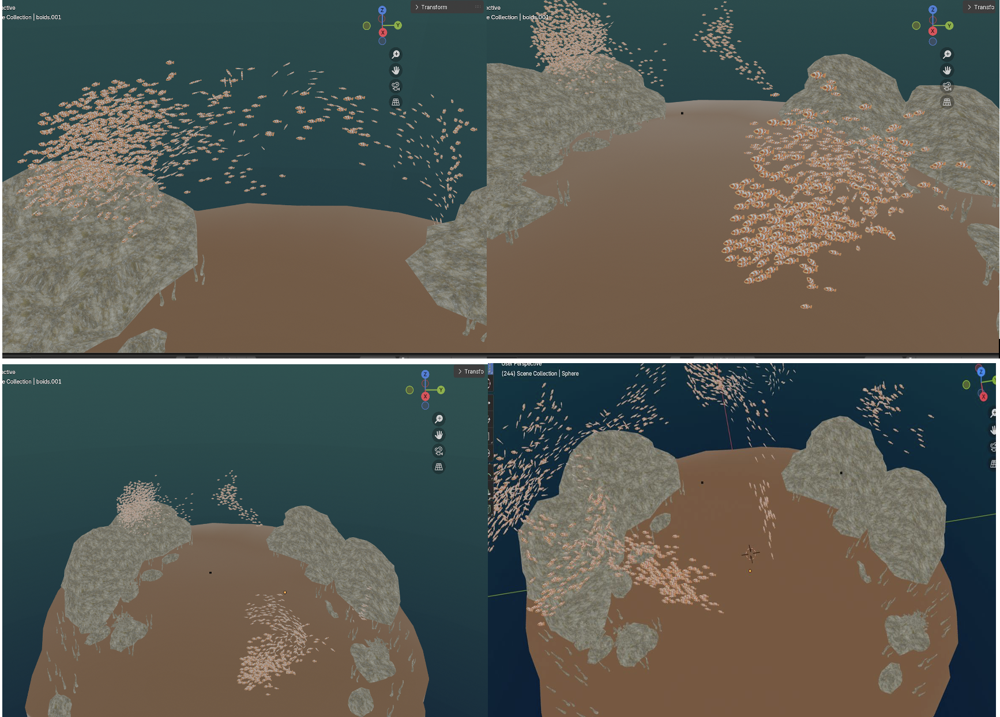
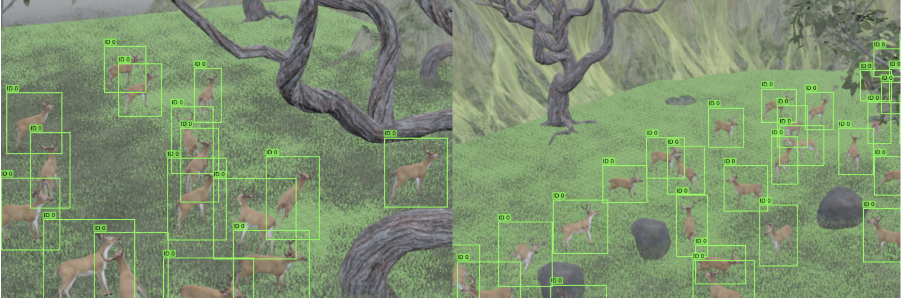

# Synthetic Dataset Generation for Large-Scale Animal Counting

This repository contains the **Blender-based synthetic data generation pipeline** developed as part of the research paper:

**Generating Synthetic Datasets to Train Deep Models for Counting in Large-Scale Animal Groups**  
Iroda Ibrohimova, Madina Mirzatayeva, Gianni A. Di Caro  
Carnegie Mellon University in Qatar

This repository focuses specifically on the **3D simulation, animation, and automated annotation components** of the work.  
The synthetic datasets generated using this pipeline were later used to train and evaluate deep learning models such as **YOLOv8** (object detection) and **CSRNet** (density map–based counting), as described in the paper.

---

##  Scope of This Repository

This repository includes:

- Blender scene files (`.blend`) for:
  - Fish schools (aquatic environments)
  - Bird flocks (aerial environments)
- Python scripts for:
  - Controlling Boids-based group behavior
  - Camera motion and viewpoint randomization
  - Automated rendering
  - Automatic annotation for object counting
- Example rendered images and annotation visualizations

This repository **does not** include:
- Deep learning model training code (YOLO / CSRNet)
- Training notebooks or experiment scripts  
(these are described in the paper and maintained separately)

---

##  Synthetic Data Generation Pipeline

The pipeline uses **Blender’s Boids Particle System** to simulate realistic collective animal motion based on separation, alignment, and cohesion rules.  
Using Blender’s Python API, we automate:

1. Group motion simulation (species-specific constraints)
2. Camera placement and movement (static and dynamic)
3. High-resolution rendering
4. Automatic annotation generation:
   - YOLO-compatible bounding boxes
   - Point annotations for density map–based models

The same simulated sequence can be rendered under multiple viewpoints and densities, enabling scalable dataset creation.

---

## Example Outputs

Below are example frames and annotations generated using this pipeline.

### Fish School — Object Detection Annotations

### Fish School — Synthetic Rendering

### Bird Flock — Synthetic Rendering

### Deer — Synthetic Rendering

### Deer — Object Detection Annotations

##  Research Paper

The full paper describing the methodology, datasets, and experimental results:

[Generating Synthetic Datasets to Train Deep Models for Counting in Large-Scale Animal Groups](ICMV25_Synthetic_datasets_for_animal_counting-3.pdf)

## Blender Scene Files (Large Assets)

Due to GitHub file size limitations, the full Blender scene files used in this project are hosted externally.

* Download Blender Files:  
  https://drive.google.com/drive/folders/10Ps-hYnUGYKCbGexr3N5Nilg9rwvAAVl?usp=share_link

The repository includes all Python scripts required to reproduce the simulations once the `.blend` files are downloaded.
